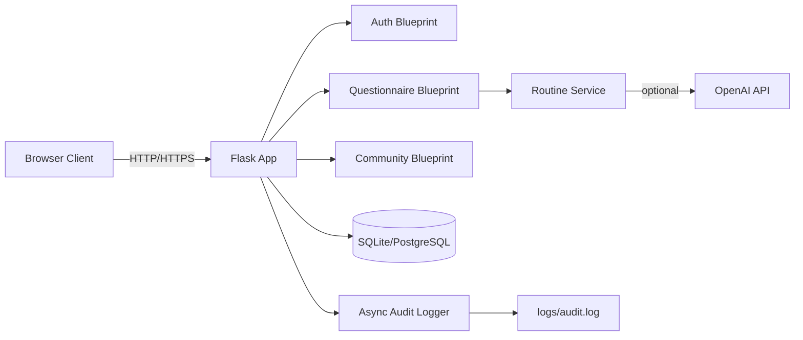
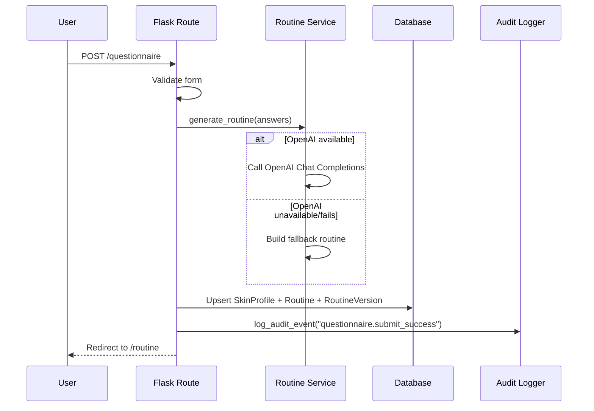

# PersonalSkin - Developer README

This document explains the solution architecture for developers, including diagrams, core classes, runtime flow, and how to present the project to a teacher.

## 1) What The System Does

`PersonalSkin` is a Flask web application that:
- lets users register/login securely,
- collects a detailed skin questionnaire,
- generates morning and evening skincare routines,
- stores versions of generated routines,
- supports community sharing with like/dislike reactions.

Routine generation uses OpenAI when available and automatically falls back to local rule-based logic when API key/SDK/requests fail.

## 2) Architecture Diagrams

### High-Level System Diagram



### Request Lifecycle (Questionnaire Submit)



## 3) Project Structure

| Path | Role |
|---|---|
| `run.py` | Development entrypoint |
| `wsgi.py` | Production WSGI entrypoint |
| `app/__init__.py` | App factory, blueprint registration, DB initialization |
| `app/config.py` | Environment-aware config (`development`/`production`) |
| `app/extensions.py` | `db` and `login_manager` singletons |
| `app/models.py` | Main DB classes and business entities |
| `app/auth/routes.py` | Register/login/logout/password reset |
| `app/questionnaire/routes.py` | Form handling and routine generation flow |
| `app/community/routes.py` | Feed, posting, reactions |
| `app/services/routine_ai.py` | AI + fallback routine generation |
| `app/services/audit_logger.py` | Async queue/thread logging to file |
| `project_portfoilo/generate_portfolio_docx.py` | Builds teacher submission DOCX automatically |

## 4) Class-By-Class Explanation

### Data Model Classes (`app/models.py`)

- `User`
  - Stores account identity and password hash.
  - Key methods: `set_password()`, `check_password()`.
  - Relationships: one `SkinProfile`, one current `Routine`, many `RoutineVersion`, many shares/reactions.
- `SkinProfile`
  - Stores questionnaire as JSON text plus summary label.
  - Key methods: `set_answers()`, `get_answers()`.
- `Routine`
  - Stores latest generated morning/evening text for a user.
  - Includes `used_openai` flag.
- `RoutineVersion`
  - Stores every historical routine version.
  - Keeps snapshot of answers per version (`answers_json`).
- `CommunityShare`
  - Public post snapshot of profile + routine at share time.
- `CommunityReaction`
  - User reaction (like/dislike), unique per `(share_id, user_id)`.

### Form Classes (Route Modules)

- `LoginForm`, `RegisterForm`, `ResetPasswordForm` in `app/auth/routes.py`
  - Includes custom password strength validator.
- `SkinQuestionnaireForm` in `app/questionnaire/routes.py`
  - Full questionnaire schema and validation rules.
- `ShareForm`, `ReactionForm` in `app/community/routes.py`
  - Community posting and CSRF-safe reaction submission.

## 5) Relevant Core Code (By Module)

- `app/__init__.py`
  - `create_app()` builds Flask app, registers blueprints, attaches Jinja filter, starts async audit logger, and calls `db.create_all()`.
- `app/auth/routes.py`
  - Handles account flows with audit logging and secure password handling.
- `app/questionnaire/routes.py`
  - Converts form to dictionary, updates profile, generates routine, writes version history.
- `app/community/routes.py`
  - Builds feed with aggregated likes/dislikes and supports toggle/update reaction behavior.
- `app/services/routine_ai.py`
  - `generate_routine()` selects OpenAI path or fallback.
  - `_build_fallback_routine()` guarantees output even without external API.
- `app/services/audit_logger.py`
  - Non-blocking queue + background worker thread writing structured JSON logs.
- `project_portfoilo/generate_portfolio_docx.py`
  - Programmatically generates the teacher-facing project document (including code excerpts and reflection sections).

## 6) How To Run

### Local Development (Windows PowerShell)

```powershell
py -3 -m venv .venv
.\.venv\Scripts\Activate.ps1
py -3 -m pip install -r requirements.txt
Copy-Item .env.example .env
py -3 run.py
```

Open: [http://127.0.0.1:5000](http://127.0.0.1:5000)

### Environment Variables (`.env`)

- `FLASK_SECRET_KEY` - required for secure sessions/CSRF.
- `FLASK_CONFIG` - `development` or `production`.
- `DATABASE_URL` - optional; defaults to SQLite `personal_skin.db`.
- `OPENAI_API_KEY` - optional; without it, fallback routine is used.
- `OPENAI_MODEL` - optional; default is `gpt-4o-mini`.

### Production

- Use `wsgi.py` with `gunicorn` (Linux hosting).
- If using hosted Postgres providers, `postgres://` is auto-converted to `postgresql://` in config.

## 7) How To Generate Teacher Portfolio File

The project includes a generator for your final submission DOCX:

```powershell
py -3 .\project_portfoilo\generate_portfolio_docx.py
```

Generated file:
- `project_portfoilo/תיק פרויקט - PersonalSkin.docx`

This file already includes:
- architecture explanation,
- test table,
- developer guide section,
- reflection section,
- bibliography,
- code appendix snippets from real project files.

## 8) How To Present/Reflect To The Teacher

Use this simple presentation flow:

1. **Problem + users**
   - Explain skin-care confusion problem and why personalized routine matters.
2. **Architecture**
   - Show the two diagrams from this README.
3. **Core classes**
   - Present `User`, `SkinProfile`, `Routine`, `RoutineVersion` and why each exists.
4. **Security & reliability**
   - Mention password hashing, CSRF, HTML sanitization, async audit logs, AI fallback.
5. **Live demo**
   - Register -> fill questionnaire -> generate routine -> share in community.
6. **Reflection**
   - What worked well, what was hard, and what you would improve next.

### Recommended reflection points (say these clearly)

- What I learned:
  - Flask architecture, DB modeling, form validation, secure auth flow, external API integration.
- Main challenge:
  - Keeping app reliable when OpenAI is unavailable.
- Design decision:
  - Added fallback generator + routine version history.
- Security awareness:
  - Password hashing, CSRF, sanitized markdown, structured audit logs.
- Next improvements:
  - Token-based email password reset, admin dashboard, richer analytics/tests.

## 9) Quick Developer Checklist

- [ ] App starts with `py -3 run.py`
- [ ] Registration and login work
- [ ] Questionnaire saves and routine is generated
- [ ] Community share and reactions work
- [ ] `logs/audit.log` is being written
- [ ] DOCX portfolio is generated successfully

---

Medical notice: generated skincare guidance is informational and does not replace medical advice.
# PersonalSkin

אפליקציית ווב (Flask) להתאמת שגרת טיפוח פנים אישית: משתמשים נרשמים, ממלאים שאלון פרופיל עור מפורט, ומקבלים שגרת **בוקר** ו**ערב** בטקסט — שנוצרת באמצעות **מודל שפה (OpenAI)** כשמוגדר מפתח API, או לפי **מצב גיבוי** מבוסס כללים כשאין מפתח או כשהקריאה נכשלת. קיים גם **דף קהילה** לצפייה בשיתופים של משתמשים ולפרסום עותק של הפרופיל והשגרה (עם שם לתצוגה).

הממשק והתוכן מוצגים בעברית וכיוון **RTL**. ההמלצות מיועדות להסבר כללי בלבד ואינן תחליף לייעוץ רפואי או מקצועי.

---

## מה האפליקציה עושה (זרימה קצרה)

1. **דף הבית** — קישורים להרשמה, התחברות, או צפייה בקהילה (גם ללא התחברות).
2. **הרשמה / התחברות** — משתמשים מאומתים עם אימייל וסיסמה; סיסמאות נשמרות כ־hash (Werkzeug). סשן נשמר עם Flask-Login (`remember=True`).
3. **שאלון עור** — לאחר התחברות: טופס עם סוג עור, גיל, חששות, רגישויות, מטרות, תקציב, זמן זמין, אקלים, הרגלי SPF, איפור, אקספוליאציה, רטינול, הריון/הנקה, ועוד. השמירה יוצרת/מעדכנת `SkinProfile` ו־`Routine` במסד.
4. **שגרה** — הטקסט מוצג כ־Markdown מסונן (Bleach) ל־HTML. אם נעשה שימוש ב־OpenAI, השדה `used_openai` במסד משקף זאת.
5. **קהילה** — פיד של עד 50 שיתופים אחרונים; משתמש מחובר יכול לפרסם פוסט עם שם לתצוגה (עותק טקסט של פרופיל ושגרה בזמן הפרסום).

מסד הנתונים הוא **SQLite** (`personal_skin.db` בספריית ההרצה, אלא אם הוגדר `DATABASE_URL`). הקובץ נוצר אוטומטית בעת עליית האפליקציה (`db.create_all()`).

---

## דרישות

- Python **3.10+** (נבדק עם 3.12)
- חבילות Python: ראו `requirements.txt`

---

## עמידה בדרישות הפרויקט (מפורט)

להלן מיפוי מפורט של דרישות ההגשה מול המימוש בפועל בפרויקט:

### 1) מימוש לפחות 2 מחלקות שונות הכוללות עצמים ופעולות על העצמים

קיים מימוש מלא של מספר מחלקות ב־`app/models.py`, כולל פעולות (methods) על עצמים:

- `User`:
  - שדות: `email`, `password_hash`, `first_name`, `last_name`, ועוד.
  - פעולות על עצם: `set_password()`, `check_password()`.
- `SkinProfile`:
  - שדות: `questionnaire_json`, `summary_label`, `updated_at`.
  - פעולות על עצם: `set_answers()`, `get_answers()`.
- מחלקות נוספות: `Routine`, `RoutineVersion`, `CommunityShare`.

בפועל נוצרים עצמים מהמחלקות האלה ברישום, מילוי שאלון, יצירת שגרה ושיתוף בקהילה, ונשמרים במסד הנתונים.

### 2) מערכת שרת-לקוח

המערכת ממומשת בתצורת **שרת-לקוח מפורשת** עם שני שכבות:

**אימות (login / register / reset_password) — TCP sockets**

- **שרת אימות**: `run_auth_server.py` → `app/socket_auth/server.py` — מאזין על TCP (ברירת מחדל פורט **5050**), פרוטוקול JSON (אורך 4 בתים + גוף).
- **לקוח אימות**: `app/socket_auth/client.py` — Flask שולח בקשות TCP לשרת בעת שליחת טפסי התחברות/הרשמה.
- **הדגמה ממחשב שני**: `socket_auth_client_demo.py` (שורת פקודה).

**שאר האפליקציה — HTTP (Flask Web)**

- **שרת Web**: Flask — `app/questionnaire/routes.py`, `app/community/routes.py`, וממשק HTML ל-auth.
- **לקוח**: דפדפן (HTML/CSS ב־`templates/` + `static/css/`).
- **פרוטוקול**: HTTP/HTTPS לדפים ולשאלון/קהילה; TCP ל-auth בלבד.
- **סשן**: לאחר אימות מוצלח בשרת הסוקטים, Flask-Login יוצר סשן בדפדפן.

### 3) שימוש בבינה מלאכותית (בונוס)

קיים שימוש ב־AI בשירות יצירת שגרה:

- קובץ: `app/services/routine_ai.py`
- שימוש ב־OpenAI (`chat.completions.create`) ליצירת שגרת בוקר/ערב לפי תשובות השאלון.
- כאשר אין `OPENAI_API_KEY` או שיש כשל API, מופעל מנגנון גיבוי מבוסס כללים כדי לשמור על רציפות תפקודית.

### 4) מערכת הפעלה

הפרויקט ניתן להרצה בסביבות מערכת הפעלה שונות:

- **Windows** (פיתוח מקומי באמצעות PowerShell ו־Python)
- **Linux** (סביבת הרצה בענן ב־Render)

בנוסף, קיימות הוראות מפורטות ב־README להפעלה, עצירה והפעלה מחדש של השירות.

### 5) הצפנת סיסמאות

סיסמאות אינן נשמרות כטקסט גלוי:

- שימוש ב־`werkzeug.security` ל־hash של סיסמאות (`generate_password_hash`).
- אימות סיסמה מתבצע עם `check_password_hash`.
- המימוש נמצא ב־`app/models.py` ונעשה בו שימוש בזרימות הרשמה, התחברות ואיפוס סיסמה.

### 6) ממשק משתמש

קיים ממשק משתמש מלא מבוסס Web:

- תבניות HTML: `templates/`
- עיצוב CSS: `static/css/style.css`
- מסכים מרכזיים:
  - דף בית
  - הרשמה / התחברות / שכחתי סיסמה
  - שאלון פרופיל עור
  - תצוגת שגרה מותאמת
  - דף קהילה ושיתופים

---

## עמידה בדרישות תקשורת, אבטחה ותשתיות (Checklist)

### האם קיים פרוטוקול תקשורת ברור

כן. המערכת עובדת במודל לקוח-שרת מבוסס HTTP/HTTPS:

- הדפדפן (לקוח) מתקשר עם Flask (שרת) דרך Routes.
- בייצור (Render) הגישה מתבצעת ב־HTTPS.

### שימוש ב-Threads בפרויקט

כן. קיימת מערכת לוגים אסינכרונית מבוססת Thread נפרד:

- קובץ: `app/services/audit_logger.py`
- מנגנון: `Queue` + `Thread` ייעודי (`audit-log-worker`).
- ה-main thread של הבקשה לא כותב לוג ישירות לדיסק; הוא רק שולח אירוע לתור.

### עבודה עם קבצים / API / רכיבי מערכת

כן, בכל שלושת הרבדים:

- **קבצים**: תבניות `templates/`, עיצוב `static/css/`, קבצי קונפיג (`.env`, `render.yaml`), וקובץ לוג `logs/audit.log`.
- **API חיצוני**: OpenAI ב־`app/services/routine_ai.py`.
- **רכיבי מערכת**: משתני סביבה, שרת WSGI (`gunicorn`), תהליך פריסה בענן.

### הצפנה של מידע רגיש

כן, עבור סיסמאות:

- סיסמאות נשמרות כ-Hash באמצעות `generate_password_hash`.
- אימות סיסמה נעשה עם `check_password_hash`.
- הסיסמה עצמה אינה נשמרת כטקסט גלוי במסד הנתונים.

### טיפול בפרצות אבטחה

כן, קיימים מנגנוני הגנה מרכזיים:

- **CSRF Protection** דרך Flask-WTF.
- **XSS Mitigation**: סינון Markdown/HTML עם `bleach`.
- **Password Policy**: דרישה לאותיות, מספרים ותו מיוחד.
- **Audit Logging**: תיעוד אירועי אבטחה (למשל login failure, password reset).

### תעבורה מוצפנת TLS או שיטה אחרת

כן. בסביבת Render התעבורה למשתמשים מתבצעת דרך HTTPS (TLS).

### ממשק משתמש אטרקטיבי

כן. יש ממשק Web מלא, אחיד ו־RTL בעברית:

- דפי בית, הרשמה, התחברות, שכחתי סיסמה.
- שאלון עור, שגרת טיפוח מותאמת, קהילה.
- עיצוב CSS מותאם בתיקיית `static/css/`.

### עבודה עם בסיס נתונים או שמירה לקבצים (JSON)

כן:

- **בסיס נתונים**: SQLite בפיתוח / PostgreSQL בפרודקשן (`DATABASE_URL`).
- **JSON**: תשובות שאלון נשמרות כ־JSON בטבלאות (`questionnaire_json`, `answers_json`).

---

## התקנה (פעם ראשונה)

```text
cd personal_skin
py -3 -m venv .venv
.\.venv\Scripts\Activate.ps1
py -3 -m pip install -r requirements.txt
```

ב־Linux/macOS ניתן להחליף את הפעלת ה־venv ב־`source .venv/bin/activate`.

---

## הפעלה, עצירה והפעלה מחדש

כל הפקודות מניחות שאתם בספריית שורש הפרויקט (`personal_skin`) ושה־venv מופעל אם משתמשים בו.

### הפעלה (הרצת שרת הפיתוח)

**חובה — שני תהליכים** (טרמינלים נפרדים, או `.\run_both.ps1`):

```text
py -3 run_auth_server.py
```

```text
py -3 run.py
```

ברירת המחדל: Web על `http://0.0.0.0:5000`, אימות TCP על `0.0.0.0:5050`. משתני סביבה: `AUTH_SOCKET_HOST`, `AUTH_SOCKET_PORT` (ראו `.env.example`).

אלטרנטיבה מקובלת:

```text
set FLASK_APP=run.py
py -3 -m flask run --host 127.0.0.1 --port 5000
```

(ב־PowerShell: `$env:FLASK_APP="run.py"` לפני `flask run`.)

### עצירה

- בחלון הטרמינל שבו רץ השרת: **Ctrl+C** (SIGINT) — עוצר את התהליך.

### הפעלה מחדש

1. עצירה עם **Ctrl+C**.
2. הרצה שוב של `py -3 run.py` (או `flask run` כמעלה).

### הערות לסביבת ייצור

- הקוד ב־`run.py` מיועד ל**פיתוח** (שרת מובנה של Flask). לייצור מומלץ שרת WSGI (למשל Gunicorn בלינוקס, Waitress בווינדוס) מאחורי reverse proxy עם HTTPS.
- משתנה סביבה **`FLASK_CONFIG`**: `development` (ברירת מחדל) או `production` — ראו `app/config.py` (ב־production מוגדר `DEBUG = False`).

---

## הגדרות (קובץ `.env`)

1. העתיקו `.env.example` ל־`.env` בשורש הפרויקט.
2. **`FLASK_SECRET_KEY`** — מחרוזת אקראית ארוכה לחתימת סשן ו־CSRF; **חובה לשנות בייצור**.
3. **`OPENAI_API_KEY`** — אופציונלי. ללא מפתח, או אם ה־SDK/הקריאה נכשלים, תופעל שגרת הגיבוי.
4. **`OPENAI_MODEL`** — אופציונלי; ברירת מחדל בקוד: `gpt-4o-mini`.
5. **`DATABASE_URL`** — אופציונלי; אם לא מוגדר, משתמשים ב־`sqlite:///personal_skin.db`.
6. **`FLASK_CONFIG`** — `development` או `production`.

---

## פריסה ל-Render (URL קבוע)

כדי לקבל URL ציבורי קבוע לאפליקציה, הפרויקט כולל כעת קובץ `render.yaml` עם הגדרות ברירת מחדל ל-Web Service.

### מה נוסף בפרויקט לצורך Render

- `render.yaml` — הגדרת שירות Render (build/start/env).
- `wsgi.py` — נקודת כניסה לשרת production (`wsgi:app`).
- `gunicorn` ו־`psycopg2-binary` נוספו ל־`requirements.txt`.
- בסיס נתונים מנוהל (`Render Postgres`) מוגדר ב־`render.yaml` ומחובר דרך `DATABASE_URL`.

### שלבי Deploy

1. דחפו את הקוד ל־GitHub (כולל `render.yaml` ו־`wsgi.py`).
2. ב־Render בחרו **New +** -> **Blueprint** (מומלץ, מזהה `render.yaml`) או **Web Service**.
3. חברו את הריפו ובצעו deploy.
4. ב־Environment Variables הגדירו לפחות:
   - `OPENAI_API_KEY` (אם רוצים יצירת שגרה דרך מודל)
   - `FLASK_SECRET_KEY` (אם לא משתמשים ב־`generateValue` מה־Blueprint)
   - אופציונלי: `OPENAI_MODEL`
5. לאחר deploy תקבלו URL בסגנון:
   - `https://personal-skin.onrender.com`

### חשוב לגבי 24/7

- URL של Render הוא קבוע כל עוד שם השירות נשאר קבוע.
- כדי שהשירות יהיה פעיל **24/7 ללא sleep**, השתמשו בתוכנית בתשלום (למשל `Starter`).
- בתוכניות חינמיות שירותים עשויים \"להירדם\" לאחר חוסר פעילות.
- כדי שכל המשתמשים יראו אותם שיתופים מכל מחשב, חובה לעבוד עם `DATABASE_URL` של Postgres (ולא SQLite מקומי).

---

## למפתחים

### טכנולוגיות (סטאק)

| שכבה | טכנולוגיה |
|------|-----------|
| שפת שרת | Python 3 |
| מסגרת ווב | Flask 3 |
| ORM / DB | Flask-SQLAlchemy, SQLite (ברירת מחדל) |
| אימות | Flask-Login, סיסמאות ב־hash (Werkzeug) |
| טפסים / CSRF | Flask-WTF, WTForms, `email-validator` |
| תצוגת טקסט עשיר | `markdown`, `bleach` (סינון HTML), `markupsafe` |
| הגדרות | `python-dotenv` |
| AI (אופציונלי) | OpenAI Python SDK (`openai`), Chat Completions |

### מבנה תיקיות

| נתיב | תיאור |
|------|--------|
| `run.py` | נקודת כניסה; יוצר אפליקציה עם `FLASK_CONFIG` |
| `app/__init__.py` | `create_app`, רישום blueprints, `db.create_all()` |
| `app/config.py` | `DevelopmentConfig` / `ProductionConfig` |
| `app/extensions.py` | `SQLAlchemy`, `LoginManager` |
| `app/models.py` | `User`, `SkinProfile`, `Routine`, `CommunityShare` |
| `app/auth/` | הרשמה, התחברות, התנתקות |
| `app/questionnaire/` | שאלון ושגרה |
| `app/community/` | פיד ושיתוף |
| `app/services/routine_ai.py` | יצירת שגרה (OpenAI או גיבוי) |
| `app/utils.py` | פילטר Jinja `markdown_safe` |
| `templates/` | תבניות HTML (עברית) |
| `static/css/` | עיצוב |

### פרוטוקולים והתנהגות טכנית

- **HTTP**: הדפדפן מדבר עם שרת Flask ב־HTTP מקומי (פיתוח). בייצור יש להפעיל **HTTPS** מול המשתמש (למשל TLS ב־reverse proxy).
- **סשן ואימות**: Flask-Login מזהה משתמש לפי סשן; דפים שדורשים התחברות מפנים ל־`/login` (`login_manager.login_view`).
- **CSRF**: `WTF_CSRF_ENABLED = True` (ברירת מחדל); טפסי WTForms כוללים אסימון CSRF.
- **מסד נתונים**: SQLite קובץ מקומי; לגיבוי — העתקת קובץ ה־`.db` (כשהשרת לא כותב אליו, או אחרי עצירה נקייה).
- **OpenAI**: נעשה שימוש ב־**Chat Completions API** (`client.chat.completions.create`). התוכן נשלח כ־prompt מערכת + משתמש; אין בפרויקט זה endpoint REST חיצוני ללקוח — רק שרת־ל־שרת מול OpenAI.
- **Markdown**: תוכן שגרה ופוסטים מעובר דרך Markdown ואז **Bleach** עם רשימת תגים מותרים — להפחתת XSS.

### דיווח על באגים ובקשות

- **מאגר Git**: ניתן לדווח באמצעות **Issues** ב־GitHub (אם הפרויקט מופיע שם), או בערוץ שבו הצוות מנהל משימות.
- מומלץ לצרף: גרסת Python, מערכת הפעלה, צעדים לשחזור, פלט שגיאה מהטרמינל (ללא מפתחות API או סיסמאות), וצילום מסך אם רלוונטי.
- אל תדביקו ל־Issues את תוכן `.env` או מפתחות.

### סקריפט עזר (אופציונלי)

- `upload-to-github.ps1` — סקריפט PowerShell לעזרה בהעלאת המאגר ל־GitHub (דורש `git` ו־`gh`). לא נדרש להרצת האפליקציה.

---

## הערה משפטית

ההמלצות באפליקציה מיועדות להסבר כללי בלבד ואינן תחליף לייעוץ רפואי, רוקחי או מקצועי.
